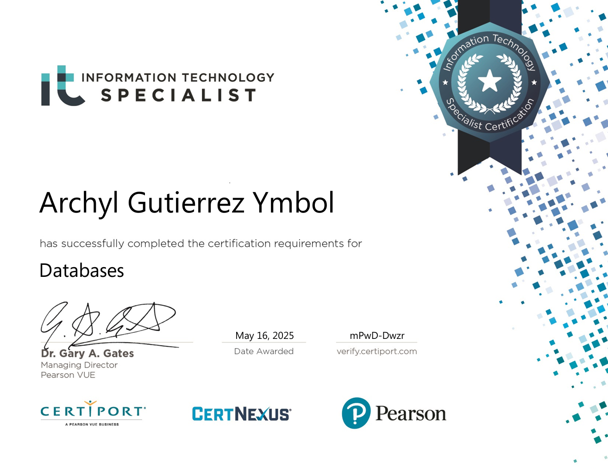

# `Archyl G. Ymbol`

**Bachelor of Science in Computer Science**  
University of Mindanao · Philippines

---

# 💫 About Me

* Interested in frontend, backend, and database-driven systems
* Have a background and interest in Artificial Intelligence and Machine Learning
* Also have a background in Cybersecurity
* Currently learning and improving through projects and hands-on practice

---

# 💻 Tech Stack

---

# 🖥️ Sample Projects

> Add your project GIFs inside an `assets/projects/` folder, then change the image links below.

### MetaLift Construction Management System

### Gym Membership Website Design

### Garbage Classification System

---

# 🏅 Certifications

> Add your certificate images inside an `assets/certifications/` folder, then change the image links below.

  
  

---

# 📊 GitHub Stats

---

`still learning, still building`

